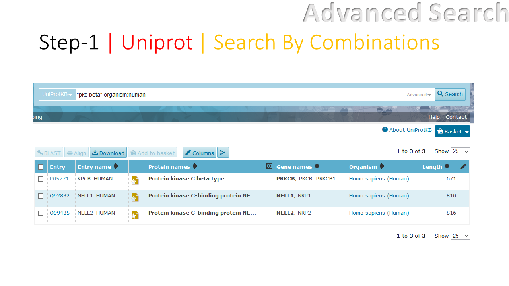

# How to search Protein Structures using their sequences

Here, very simple tutorial is given for searching the proteins strucutres using their sequences.  

## 1

---

## 2

---

## 3

---

## 4

---

## 5

---

## 6

---

## 7

---

## 8

---

## 9

---

## 10

---

## 11

---

## 12

---

